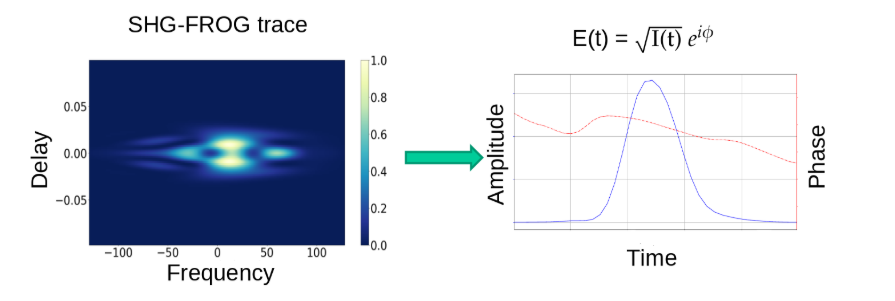
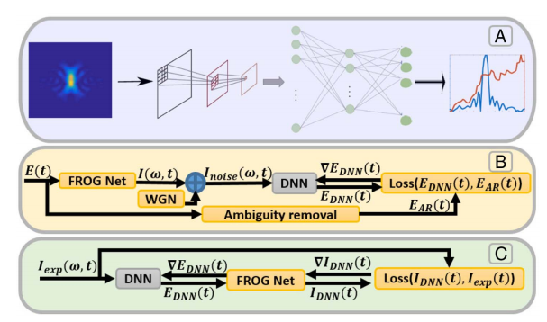
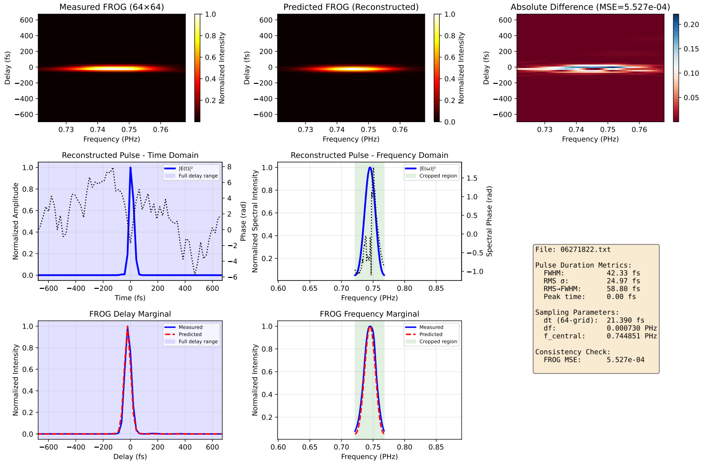

# Deep-learning-model-for-ultrashort-pulses-reconstruction-from-FROG-data

## Problem description

The phase-retrieval problem appears when measuring ultrashort laser pulses. These pulses last less than a picosecond (~10-12 s), so no electronic measurement can directly capture the electric field of the pulse in the time or frequency domain. In recent years, optical techniques have advanced to the point of measuring on the attosecond scale (~10-18 s).

We use the Frequency Resolved Optical Gating system to characterize ultrashort pulse duration and the optical setups is shown in Figure 1(a). 

.png)
.png)

*Figure 1: (a)Experimental setup for measuring SHG-FROG traces.  (b)Second Harmonic Generation in lab.

The pulse is autocorrelated with a delayed copy of itself and passed through a second-harmonic generation crystal, which produces a signal proportional to the product of the two incident pulses. Variants of this setup exist, but the objective is always to send the crystal’s signal through a spectrometer and obtain the **SHG-FROG trace** of the incident pulse, which is

$$
\tilde{T}(\omega,\tau)
= \left| \int_{-\infty}^{\infty} E(t)\,E(t-\tau)\,e^{i\omega t}\,dt \right|^{2}.
$$

Note that if a temporal translation of the pulse is performed, it is conjugated or a phase shift is performed, the same SHG-FROG trace will be obtained.A mathematical manipulation can be performed on the above expression to transform it into a two-dimensional Fourier transform:

$$
\tilde{T}(\omega,\tau)
= \left| \iint_{-\infty}^{\infty}
\bar{E}_{\text{sig}}(t,\Omega)\,e^{-i\omega t - i\Omega \tau}\,dt\,d\Omega \right|^{2},
$$

There is no need to worry about understanding this last step, the important thing is to see that this expression is the square of the modulus of a two-dimensional Fourier transform of $E_{\text{sig}}$. That is, we know the amplitude of the coefficients of the Fourier transform but not its phase. This is what is known as a phase retrieval problem. For one-dimensional Fourier transforms this problem is impossible to solve, but for more than one dimension it is possible indeed.

The raw data we get from the FROG system does not directly give us the pulse duration. We need to reconstruct pulse profile first from raw data before conduct the pulse duration measurement. Conventionally, we use Principle Compoent Generalized Projections Algorithums to complete this reconstruction task. This algorithum is very time wasting and can not deal with the noisy or strange pulse situation. Here, use try to use Deep learning model to replace this traditional algorithum to reconstruct pulse profile from raw FROG data

---

## Summary

In summary, theory tells us that from a SHG-FROG trace we can recover the time-domain electric field that generated it. The electric field can be written as intensity and phase:

$$
E(t) = \sqrt{I(t)}*e^{i\phi(t)}.
$$

This electric field is passed through the experimental setup so that the SHG-FROG trace is obtained.

Here, what will be measured is the SHG-FROG trace, so this will be a two-dimensional array of $N \times N$ elements, $\tilde{T}_{mn}$ where $m,n = 0, \ldots, N-1$; and the objective is to retrieve the $2N$ numbers which represent the electric field (real and imaginary parts).

*Figure 2: Goal—transform the \(N\times N\) SHG-FROG trace into the \(2N\) values that define the time-domain electric field.*

This problem can be addressed using dedicated phase-retrieval algorithms such as **GPA**, **PIE**, or **COPRA**. See ultrafast pulse-retrieval resources for implementations and further details.

---

## Problem from DNN perspective

The aim of this project is to use **deep neural networks** to solve the phase-retrieval problem. The network’s task is to **invert** the mapping from the \(N x N\) SHG-FROG trace (real numbers) to the \(2N\) real numbers representing the electric field’s real and imaginary parts.

*Figure 3: Schematic of= the deep neural network that performs pulse retrieval.*

---

## Reconstruction of ultrashort pulses using this system

## Author

This code was developed by **Xiangfeng(William) Deng** as part of a summer research program at the **Rice University**.

For questions or comments, contact: phoenix.william.d@gmail.com

---

## Reference

Tom Zahavy, Alex Dikopoltsev, Daniel Moss, Gil Ilan Haham, Oren Cohen, Shie Mannor, and Mordechai Segev, "Deep learning reconstruction of ultrashort pulses," Optica 5, 666-673 (2018)

No reference code provided by paper author

## License
Will be upload soon

More complete and detailed manual will be unloaded soon, the author is working on PhD application paperwork
